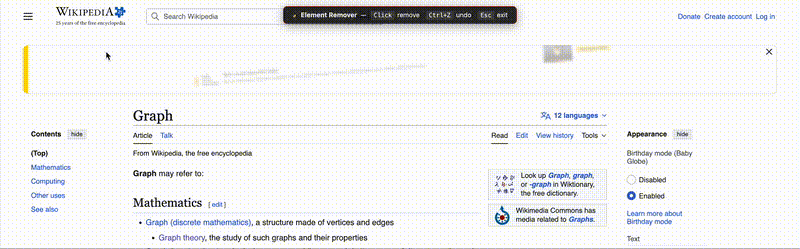

# Chrome Element Remover Plugin

## How to use

1) enable plugin
2) point at elements you want to remove
3) see the highlight
4) click to remove

## How to install

1) Download this repo
2) Open chrome://extensions/
3) Enable developer mode (top right)
4) click "load unpacked"
5) Select the "src" folder

Also you should check the code yourself or use ai for it, dont just run code you found online.